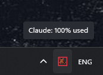
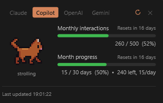
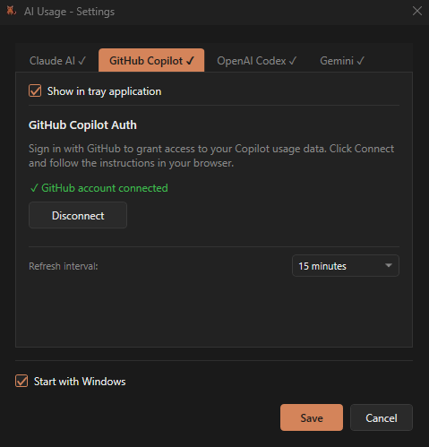

# AI Usage

A lightweight Windows system tray app that shows quota usage for Claude, GitHub Copilot, OpenAI Codex, and Gemini at a glance.

## What it does

- Sits in the **system tray** with a usage indicator icon
- **Left-click** the icon to open a popup with usage bars per provider
- Switch between providers using the tab buttons in the popup header
- Auto-refreshes on a **per-provider configurable interval**
- Clicking a provider tab forces an immediate refresh for that provider
- Manual refresh button in the popup header

## Screenshots

| System Tray | Usage Popup | Settings |
|---|---|---|
|  |  |  |

## Providers

| Provider | Auth method | What is tracked |
|---|---|---|
| **Claude AI** | Session cookie | Current session & weekly usage |
| **GitHub Copilot** | OAuth device flow | Monthly interactions & billing cycle |
| **OpenAI Codex** | OAuth device flow (Codex CLI flow) | Weekly rate limit |
| **Gemini** | OAuth credentials file | Per-model quota (Flash Lite, Flash, Pro) |

## Setup

1. Run `AIUsage.exe`
2. Right-click the tray icon → **Settings**
3. Click the tab for each provider you want to configure:
   - **Claude AI** — paste your `sessionKey` cookie from claude.ai (F12 → Application → Cookies)
   - **GitHub Copilot** — click *Connect GitHub Account* and follow the browser flow
   - **OpenAI Codex** — click *Connect OpenAI Account*, open the URL shown, enter the code
   - **Gemini** — enter Client ID, Client Secret, and path to `oauth_creds.json` (see instructions in the tab)
4. Tick **Show in tray application** for each provider you want active
5. Click **Save**

Providers only appear in the tray popup and Raw API Response window when configured and enabled.

## Gemini display modes

Configurable in Settings → Gemini tab:

| Mode | Behaviour |
|---|---|
| **Auto** | Simplifies to 3 bars (Flash Lite, Flash, Pro) when usage is similar across model versions; shows version tabs otherwise |
| **Simplified** | Always shows 3 merged bars |
| **All models** | Always shows all models grouped in Gemini 2.x / 3.x tabs |
| **Gemini 2.x only** | Shows only 2.x models |
| **Gemini 3.x only** | Shows only 3.x models |

## Cat Animations

The app features an animated cat in the popup that reacts to your current usage or "pace" (for monthly/weekly limits):

| State | Animation | Meaning |
|---|---|---|
| **strolling** | 🐈🚶 | Normal usage; on track with your quota. |
| **attention** | 🐈❗ | Very low usage (under 10%) or significantly under pace. |
| **meow** | 🐈💬 | Moderate usage (over 60%) or slightly ahead of pace. |
| **tired** | 🐈😫 | High usage (over 80%) or burning through quota too fast. |
| **sleeping** | 🐈💤 | Limit reached (100%); time to take a break! |
| **error** | 🐈❌ | Something went wrong fetching usage data. |

For GitHub Copilot and OpenAI, the cat is "pace-aware" — it looks at how much of the billing cycle has elapsed and compares it to your usage.

## Build from source

Requires [.NET 10 SDK](https://dotnet.microsoft.com/download).

```powershell
dotnet build CopilotUsage.csproj
```

Standalone executable:

```powershell
dotnet publish CopilotUsage.csproj -c Release -r win-x64 --self-contained true -p:PublishSingleFile=true -o ./publish
```

## Demo mode

```powershell
AIUsage.exe --demo
```

Cycles through usage levels without needing real credentials.

---

Created by TobiasW & Abishek Narasimhan — forked from [TobiasW-T/CopilotUsage](https://github.com/TobiasW-T/CopilotUsage)
